# ZFS Unlock

[](https://pypi.org/project/zfs-unlock/)
[](https://pypi.org/project/zfs-unlock/)
[](#setup)
[](https://github.com/basnijholt/zfs-unlock/actions/workflows/pytest.yml)
[](LICENSE)



Unlock encrypted OpenZFS datasets over SSH, through a restricted receiver on the ZFS host, with passphrases kept on a separate trusted machine.

## Why?

This is the OpenZFS counterpart to [`truenas-unlock`](https://github.com/basnijholt/truenas-unlock).
I built it after happily using `truenas-unlock`, then [switching my storage host from TrueNAS to NixOS](https://www.nijho.lt/post/truenas-to-nixos/).
It includes optional NixOS modules for declarative setup, but Nix is not required to use the Python CLI or restricted SSH receiver.

ZFS native encryption is useful, but:

1. **Storing keys on the encrypted storage host defeats the purpose**—if it's stolen, the thief has both the encrypted data and the keys
2. **Manual unlocking is tedious**—after every reboot, you need to manually decrypt each dataset

This tool solves both problems with the same **"poor-man's second-factor"** setup as `truenas-unlock`:

1. Run `zfs-unlock` on a **separate device** (Raspberry Pi, home server, etc.)
2. Store encryption passphrases **only on that device**
3. Datasets auto-unlock when both devices are on the network
4. If the storage host is stolen, data remains encrypted and inaccessible

Unlike a plain root SSH key, the receiver path is intentionally narrow:

- a dedicated `zfs-unlock` SSH user
- an SSH key restricted with `restrict`, `from=...`, and `command=...`
- sudo permission only for a root-owned receiver wrapper
- a receiver-side dataset allowlist
- a receiver parser that only accepts `status`, `unlock`, and `lock`

Think of it as a hardware security key for your storage—hidden somewhere in your house, it automatically unlocks your datasets whenever your ZFS host boots. No manual intervention required.

## Table of Contents

<!-- START doctoc generated TOC please keep comment here to allow auto update -->
<!-- DON'T EDIT THIS SECTION, INSTEAD RE-RUN doctoc TO UPDATE -->

- [Install](#install)
- [Setup](#setup)
- [Usage](#usage)
- [CLI](#cli)
- [Running as a Service](#running-as-a-service)
- [Development](#development)
- [Credits](#credits)
- [License](#license)

<!-- END doctoc generated TOC please keep comment here to allow auto update -->

## Install

Nix is optional.
`zfs-unlock` is a Python package; install it with `uv` or `pip` on the unlock device, and on the ZFS host if you configure the receiver manually.
The NixOS modules below are convenience wrappers for creating the receiver account, forced command, sudo rule, allowlist, and client service.

```bash
# With uv (recommended)
uv tool install zfs-unlock

# With pip
pip install zfs-unlock
```

## Setup

Generate a dedicated SSH key on the off-box unlock device:

```bash
zfs-unlock keygen --identity-file ~/.ssh/zfs-unlock-receiver --comment pi4-zfs-unlock
```

Add the printed public key to the receiver host's `authorizedKeys` list below, then create `~/.config/zfs-unlock/config.yaml` on the off-box unlock device:

```yaml
host: zfs-host.example.lan
user: zfs-unlock
identity_file: ~/.ssh/zfs-unlock-receiver
# command_timeout: 30

# secrets: auto  # auto (default) | files | inline

datasets:
  tank/syncthing: ~/.secrets/syncthing-key
  tank/photos: my-literal-passphrase
```

The `secrets` mode controls how values are interpreted:
- **auto** (default): if file exists, read from it; otherwise use as literal
- **files**: always treat values as file paths
- **inline**: always treat values as literal secrets

On the ZFS host, enable the forced-command receiver.
The receiver is just `zfs-unlock receiver --allow-file ... --zfs-path ...` behind a restricted SSH forced command.
With NixOS flakes, the optional module can generate that setup:

```nix
{
  inputs.zfs-unlock.url = "github:basnijholt/zfs-unlock";

  outputs = { nixpkgs, zfs-unlock, ... }: {
    nixosConfigurations.storage = nixpkgs.lib.nixosSystem {
      system = "x86_64-linux";
      modules = [
        zfs-unlock.nixosModules.receiver
        ./hosts/storage/default.nix
      ];
    };
  };
}
```

Then configure only the receiver policy on the ZFS host:

```nix
{
  services.zfsUnlock.receiver = {
    enable = true;
    allowedFrom = [ "192.168.1.50" ];
    authorizedKeys = [
      "ssh-ed25519 AAAA... unlock-device"
    ];
    datasets = [
      "tank/syncthing"
      "tank/photos"
    ];
  };
}
```

The module creates the `zfs-unlock` SSH user, forced command, sudo rule, receiver wrapper, login shell, and `/etc/zfs-unlock/allowed-datasets`.
The receiver still checks each requested dataset against that allowlist.

On a NixOS unlock device, include the client module and enable the daemon:

```nix
{
  imports = [
    zfs-unlock.nixosModules.client
  ];

  services.zfsUnlock.client = {
    enable = true;
    user = "alice";
    group = "users";
  };
}
```

The client module creates a `zfs-unlock.service` system service, runs the packaged `zfs-unlock` executable, installs that CLI into the system profile, adds OpenSSH to the service `PATH`, and sets `HOME`/`XDG_CONFIG_HOME` so the normal user config is found.

After rebuilding the receiver host, verify the client and receiver path:

```bash
zfs-unlock doctor
```

`doctor` also checks that the configured SSH identity file and file-backed dataset secrets are private to the local user.

## Usage

```bash
# Run once
zfs-unlock unlock

# Run as daemon
# (Checks every 1s if the receiver host is unreachable, otherwise every 30s)
zfs-unlock unlock --daemon

# Custom interval (for the "relaxed" state)
zfs-unlock unlock --daemon --interval 60

# Dry run
zfs-unlock unlock --dry-run

# Check config, key, network, and receiver status
zfs-unlock doctor

# Show configured dataset status
zfs-unlock status

# Lock a dataset after its services have stopped using it
zfs-unlock lock -D tank/photos

# Force-unmount mounted descendants before unloading the key
zfs-unlock lock --force -D tank/photos
```

`zfs-unlock lock` can fail with `Key unload error: '<dataset>' is busy` when a service still has files open on that dataset.
Stop the service first, or use `--force` when you intentionally want to unmount the dataset and disrupt those processes.

Bare `zfs-unlock` shows help and does not unlock anything.
Use the explicit `unlock` subcommand for state-changing unlock operations.

## CLI

```bash
zfs-unlock --help
```

<!-- CODE:BASH:START -->
<!-- export NO_COLOR=1 -->
<!-- export TERM=dumb -->
<!-- export TERMINAL_WIDTH=90 -->
<!-- echo '```bash' -->
<!-- uv run zfs-unlock --help -->
<!-- echo '```' -->
<!-- CODE:END -->

<!-- OUTPUT:START -->
<!-- ⚠️ This content is auto-generated by `markdown-code-runner`. -->
```bash

 Usage: zfs-unlock [OPTIONS] COMMAND [ARGS]...

 Unlock OpenZFS datasets over a restricted SSH receiver

╭─ Options ────────────────────────────────────────────────────────────────────╮
│ --version  -v        Show version and exit                                   │
│ --help     -h        Show this message and exit.                             │
╰──────────────────────────────────────────────────────────────────────────────╯
╭─ Client Commands ────────────────────────────────────────────────────────────╮
│ unlock    Unlock configured datasets.                                        │
│ lock      Lock configured datasets.                                          │
│ status    Show lock status of configured datasets.                           │
│ doctor    Check client config, SSH key, host reachability, and receiver      │
│           status.                                                            │
╰──────────────────────────────────────────────────────────────────────────────╯
╭─ Setup Commands ─────────────────────────────────────────────────────────────╮
│ keygen    Generate a dedicated SSH key for zfs-unlock.                       │
╰──────────────────────────────────────────────────────────────────────────────╯
╭─ Receiver Commands ──────────────────────────────────────────────────────────╮
│ receiver  Run the restricted receiver.                                       │
╰──────────────────────────────────────────────────────────────────────────────╯
╭─ Service Commands ───────────────────────────────────────────────────────────╮
│ service   Manage system service                                              │
╰──────────────────────────────────────────────────────────────────────────────╯

```

<!-- OUTPUT:END -->

## Running as a Service

On NixOS, prefer the `services.zfsUnlock.client` module shown above.
The portable CLI installer requires [uv](https://docs.astral.sh/uv/) and auto-detects Linux (systemd) or macOS (launchd):

```bash
# Install and start
zfs-unlock service install

# Check status
zfs-unlock service status

# View logs (follows by default)
zfs-unlock service logs

# Uninstall
zfs-unlock service uninstall
```

## Development

```bash
# Clone and install
git clone https://github.com/basnijholt/zfs-unlock
cd zfs-unlock
uv sync --dev

# Run tests
uv run pytest

# Run lints
uv run ruff check .
uv run mypy zfs_unlock.py
```

## Credits

Based on [`truenas-unlock`](https://github.com/basnijholt/truenas-unlock).

## License

MIT
