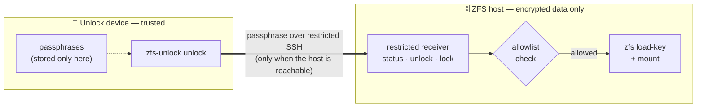

# ZFS Unlock

[](https://pypi.org/project/zfs-unlock/)
[](https://pypi.org/project/zfs-unlock/)
[](https://zfs-unlock.nijho.lt)
[](#setup)
[](https://github.com/basnijholt/zfs-unlock/actions/workflows/pytest.yml)
[](LICENSE)


Automatically unlock your encrypted OpenZFS datasets after every reboot — without keeping the keys on the machine they protect.

## Why?

OpenZFS native encryption keeps your data safe at rest, but every reboot leaves your datasets locked until the key is reloaded.
The obvious way to automate that — storing the key on the storage host — quietly defeats the point: anyone who steals the host gets the data *and* the key to it.

`zfs-unlock` keeps your passphrases on a separate, trusted device — a Raspberry Pi, a spare home server, anything small — and sends them to the storage host over a locked-down SSH channel, automatically, as soon as the host is reachable.
The keys never live on the machine they protect, so a stolen host is just a box of encrypted bytes.

Think of it as a hardware security key for your storage: a small device tucked away on your network that unlocks your datasets whenever your ZFS host boots — no manual step, no keys left behind.

## How it works

Two machines, two roles:

- the **unlock device** stores the passphrases and runs `zfs-unlock unlock` — once, or as a daemon that waits for the host to come online
- the **ZFS host** runs a restricted receiver that can only check, unlock, or lock the datasets you explicitly allow



Nix is optional: the Python CLI and the SSH receiver run anywhere, and the included NixOS modules simply automate the setup when you want it.

## Security model

Letting another machine unlock your storage sounds risky, so the receiver is deliberately narrow — nothing like handing out a root SSH key:

- a dedicated `zfs-unlock` SSH user, never root
- an SSH key restricted with `restrict`, `from=...`, and a forced `command=...`
- sudo limited to a single root-owned receiver wrapper
- a receiver-side allowlist of the datasets it may touch
- a parser that accepts only `status`, `unlock`, and `lock`

So even if the receiver key leaks, it can't run arbitrary commands on the storage host — only those three actions, only on the datasets you allowlisted, and only from a source address you allowed (a network-level restriction, not a second secret: any host sharing that source address, e.g. behind the same NAT, also passes).

Two limits of that model are worth stating plainly:

- **A leaked receiver key is still a denial-of-service key, and a passphrase-guessing oracle.** `lock` and `lock --force` don't need the passphrase, so a stolen key can lock your datasets or force-unmount them (disrupting whatever is using them). It can't *unlock* anything without the passphrase, which never leaves the unlock device — but it can *try*: a stolen key lets an attacker send unlimited `unlock` attempts, each one guessing the passphrase against `zfs load-key`, with no rate limiting on the receiver. The passphrase's own entropy is therefore the last barrier, so use a high-entropy passphrase, and consider a `fail2ban`-style guard on the receiver account.
- **Passphrase secrecy in transit depends on SSH host-key verification.** The passphrase travels to the host over SSH, so a machine-in-the-middle that host-key checking doesn't catch could capture it. The client pins `StrictHostKeyChecking=ask` on the ssh command line (which, combined with batch mode, means *refuse* rather than prompt), so it fails closed on an unknown or changed host key instead of trusting it blindly — even if your `ssh_config` sets `StrictHostKeyChecking accept-new` (or `no`) for this host. That protection only holds if you pin the real key first: before first use, add the host key to `known_hosts` and verify its fingerprint out of band (`zfs-unlock doctor` prints the exact `ssh-keyscan` command when the key is missing).

## Table of Contents

<!-- START doctoc generated TOC please keep comment here to allow auto update -->
<!-- DON'T EDIT THIS SECTION, INSTEAD RE-RUN doctoc TO UPDATE -->

- [Install](#install)
- [Setup](#setup)
- [Usage](#usage)
- [CLI](#cli)
- [Running as a Service](#running-as-a-service)
- [Stability](#stability)
- [Development](#development)
- [Credits](#credits)
- [License](#license)

<!-- END doctoc generated TOC please keep comment here to allow auto update -->

## Install

Nix is optional.
`zfs-unlock` is a Python package; install it with `uv` or `pip` on the unlock device, and on the ZFS host if you configure the receiver manually.
The NixOS modules below are convenience wrappers for creating the receiver account, forced command, sudo rule, allowlist, and client service.

```bash
# With uv (recommended)
uv tool install zfs-unlock

# With pip
pip install zfs-unlock
```

## Setup

Generate a dedicated SSH key on the off-box unlock device:

```bash
zfs-unlock keygen --identity-file ~/.ssh/zfs-unlock-receiver --comment pi4-zfs-unlock
```

Add the printed public key to the receiver host's `authorizedKeys` list below, then create `~/.config/zfs-unlock/config.yaml` on the off-box unlock device:

```yaml
host: zfs-host.example.lan
user: zfs-unlock
identity_file: ~/.ssh/zfs-unlock-receiver
# port: 22
# connect_timeout: 5
# command_timeout: 30

# secrets: auto  # auto (default) | files | inline

datasets:
  tank/syncthing: ~/.secrets/syncthing-key
  tank/photos: my-literal-passphrase
```

The `secrets` mode controls how values are interpreted:
- **auto** (default): if file exists, read from it; otherwise use as literal
- **files**: always treat values as file paths
- **inline**: always treat values as literal secrets

On the ZFS host, enable the forced-command receiver.
The receiver is just `zfs-unlock receiver --allow-file ... --zfs-path ...` behind a restricted SSH forced command.
With NixOS flakes, the optional module can generate that setup:

```nix
{
  inputs.zfs-unlock.url = "github:basnijholt/zfs-unlock";

  outputs = { nixpkgs, zfs-unlock, ... }: {
    nixosConfigurations.storage = nixpkgs.lib.nixosSystem {
      system = "x86_64-linux";
      modules = [
        zfs-unlock.nixosModules.receiver
        ./hosts/storage/default.nix
      ];
    };
  };
}
```

Then configure only the receiver policy on the ZFS host:

```nix
{
  services.zfs-unlock.receiver = {
    enable = true;
    allowedFrom = [ "192.168.1.50" ];
    authorizedKeys = [
      "ssh-ed25519 AAAA... unlock-device"
    ];
    datasets = [
      "tank/syncthing"
      "tank/photos"
    ];
  };
}
```

The module creates the `zfs-unlock` SSH user, forced command, sudo rule, receiver wrapper, login shell, and `/etc/zfs-unlock/allowed-datasets`.
The receiver still checks each requested dataset against that allowlist.
By default the module also enables systemd linger for the receiver user.
That keeps the receiver user's systemd user manager stable across short-lived forced-command SSH sessions and avoids NixOS switch-time D-Bus races after the receiver account has been used.
Set `services.zfs-unlock.receiver.enableLinger = false` if you do not want the module to manage linger for that user.

On a NixOS unlock device, include the client module and enable the daemon:

```nix
{
  imports = [
    zfs-unlock.nixosModules.client
  ];

  services.zfs-unlock.client = {
    enable = true;
    user = "alice";
    group = "users";
  };
}
```

The client module creates a `zfs-unlock.service` system service, runs the packaged `zfs-unlock` executable, installs that CLI into the system profile, adds OpenSSH to the service `PATH`, and sets `HOME`/`XDG_CONFIG_HOME` so the normal user config is found.

After rebuilding the receiver host, verify the client and receiver path:

```bash
zfs-unlock doctor
```

`doctor` also checks that the configured SSH identity file and file-backed dataset secrets are private to the local user.

## Usage

```bash
# Run once
zfs-unlock unlock

# Run as daemon
# (Polls every 30s; every 1s while the host is unreachable, capped at ~5 min)
zfs-unlock unlock --daemon

# Custom interval (for the "relaxed" state)
zfs-unlock unlock --daemon --interval 60

# Dry run
zfs-unlock unlock --dry-run

# Check config, key, network, and receiver status
zfs-unlock doctor

# Show configured dataset status
zfs-unlock status

# Lock a dataset after its services have stopped using it
zfs-unlock lock -D tank/photos

# Force-unmount mounted descendants before unloading the key
zfs-unlock lock --force -D tank/photos
```

`-D` selects datasets by exact path or glob (for example `-D 'tank/*'`); it never matches substrings.
Unlike shell globs, `*` also matches across `/`: `tank/*` selects every configured dataset under `tank`, nested children included.

`zfs-unlock lock` can fail with `Key unload error: '<dataset>' is busy` when a service still has files open on that dataset.
Stop the service first, or use `--force` when you intentionally want to unmount the dataset and disrupt those processes.
Even with `--force`, OpenZFS can refuse to unmount a dataset that is still held by NFS, SMB, client mounts, or kernel users.
Unmount clients or stop exports first, then retry the lock.

Bare `zfs-unlock` shows help and does not unlock anything.
Use the explicit `unlock` subcommand for state-changing unlock operations.

## CLI

```bash
zfs-unlock --help
```

<!-- CODE:BASH:START -->
<!-- export NO_COLOR=1 -->
<!-- export TERM=dumb -->
<!-- export TERMINAL_WIDTH=90 -->
<!-- echo '```bash' -->
<!-- uv run zfs-unlock --help -->
<!-- echo '```' -->
<!-- CODE:END -->

<!-- OUTPUT:START -->
<!-- ⚠️ This content is auto-generated by `markdown-code-runner`. -->
```bash

 Usage: zfs-unlock [OPTIONS] COMMAND [ARGS]...

 Unlock OpenZFS datasets over a restricted SSH receiver

╭─ Options ────────────────────────────────────────────────────────────────────╮
│ --version  -v        Show version and exit                                   │
│ --help     -h        Show this message and exit.                             │
╰──────────────────────────────────────────────────────────────────────────────╯
╭─ Client Commands ────────────────────────────────────────────────────────────╮
│ unlock    Unlock configured datasets.                                        │
│ lock      Lock configured datasets.                                          │
│ status    Show lock status of configured datasets.                           │
│ doctor    Check client config, SSH key, host reachability, and receiver      │
│           status.                                                            │
╰──────────────────────────────────────────────────────────────────────────────╯
╭─ Setup Commands ─────────────────────────────────────────────────────────────╮
│ keygen    Generate a dedicated SSH key for zfs-unlock.                       │
╰──────────────────────────────────────────────────────────────────────────────╯
╭─ Receiver Commands ──────────────────────────────────────────────────────────╮
│ receiver  Run the restricted receiver.                                       │
╰──────────────────────────────────────────────────────────────────────────────╯
╭─ Service Commands ───────────────────────────────────────────────────────────╮
│ service   Manage system service                                              │
╰──────────────────────────────────────────────────────────────────────────────╯

```

<!-- OUTPUT:END -->

## Running as a Service

On NixOS, prefer the `services.zfs-unlock.client` module shown above.
The portable CLI installer auto-detects Linux (systemd) or macOS (launchd) and pins the service to the `zfs-unlock` executable currently on `PATH`, so the daemon always runs the same version you installed.
If `zfs-unlock` is not on `PATH`, it falls back to launching the latest release through [uv](https://docs.astral.sh/uv/).

```bash
# Install and start
zfs-unlock service install

# Check status
zfs-unlock service status

# View logs (follows by default)
zfs-unlock service logs

# Uninstall
zfs-unlock service uninstall
```

## Stability

As of v1.0.0 these interfaces are stable and only change with a major version bump:

- the CLI commands (`unlock`, `lock`, `status`, `doctor`, `keygen`, `receiver`, `service`) and their documented flags, including the exact-or-glob `-D` selection semantics
- the config file keys and their meaning (`host`, `user`, `port`, `identity_file`, `connect_timeout`, `command_timeout`, `secrets`, `datasets`)
- the receiver wire protocol: `status <dataset>`, `unlock <dataset>` (passphrase on stdin), `lock <dataset> [--force]`, passed via `SSH_ORIGINAL_COMMAND` and parsed as shell words. Changes are strictly additive — new verbs or status strings may appear, existing ones keep their argv shape — so a v1 client always works against a newer receiver
- the NixOS module option paths under `services.zfs-unlock.receiver` and `services.zfs-unlock.client`
- the allowlist format of `/etc/zfs-unlock/allowed-datasets` (one dataset per line, `#` comments)

The internal Python API (`zfs_unlock.*` modules) is not a stable interface.

## Development

```bash
# Clone and install
git clone https://github.com/basnijholt/zfs-unlock
cd zfs-unlock
uv sync --dev

# Run tests
uv run pytest

# Run lints
uv run ruff check .
uv run mypy zfs_unlock
```

## Credits

`zfs-unlock` grew out of [`truenas-unlock`](https://github.com/basnijholt/truenas-unlock): I used that happily on TrueNAS, then built this generic OpenZFS version after [moving my storage host from TrueNAS to NixOS](https://www.nijho.lt/post/truenas-to-nixos/).

## License

MIT
